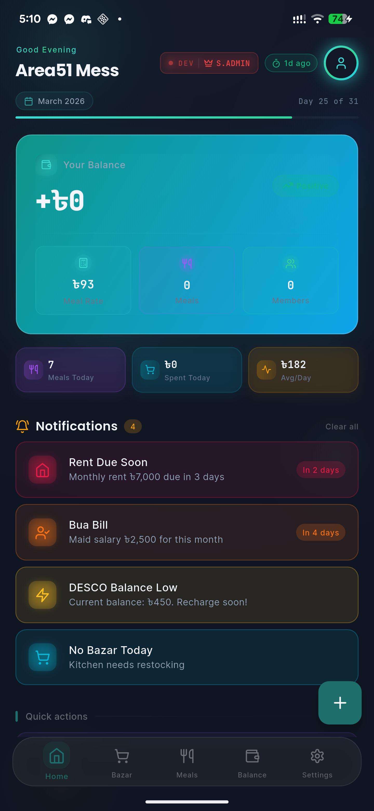
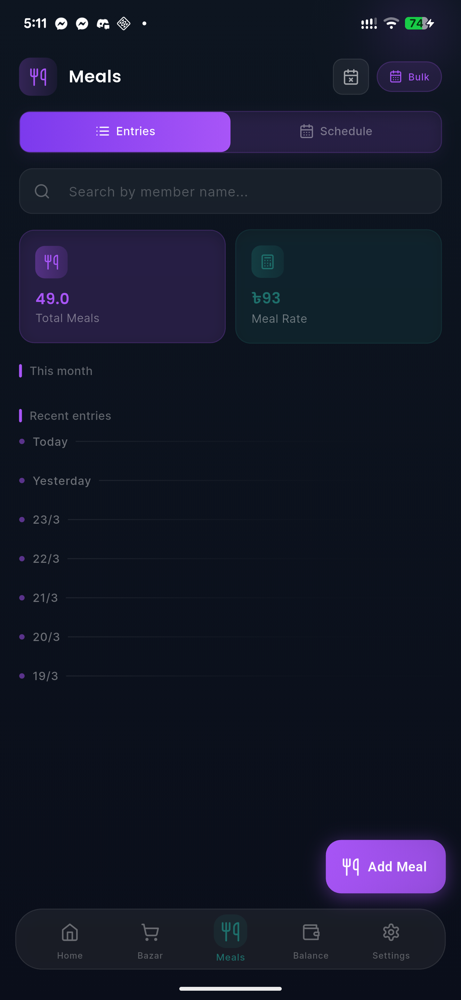
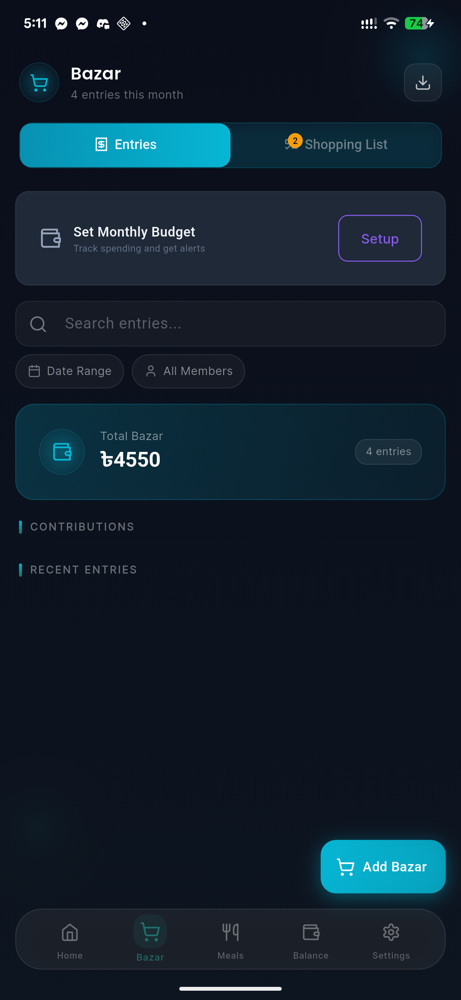
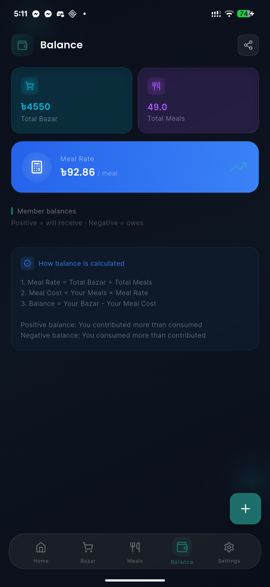
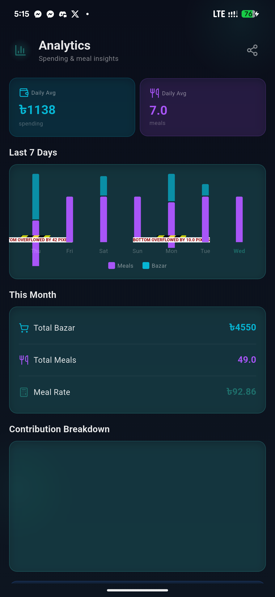
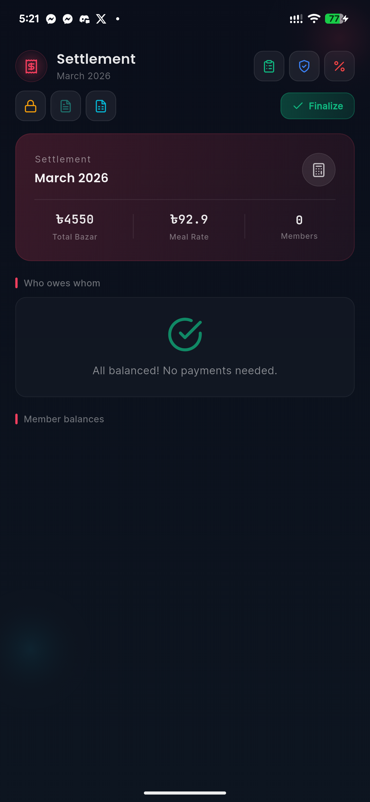
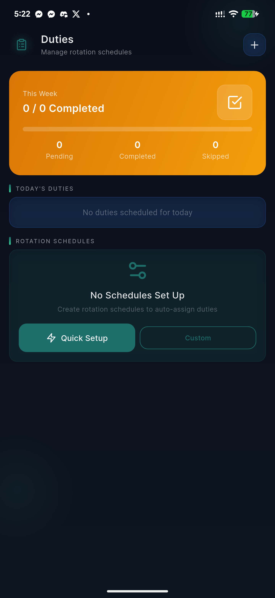
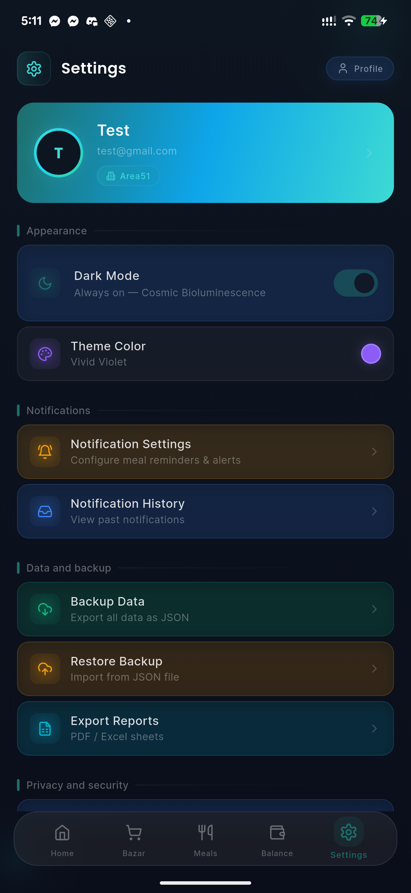

# Mess Manager

Smart expense and meal tracking for shared living groups. Built with Flutter.

[](https://flutter.dev)
[](https://dart.dev)
[](https://github.com/EhsanulHaqueSiam/Mess-Manager/actions)
[]()

## Screenshots

<p align="center">
  
  
  
  
</p>
<p align="center">
  
  
  
  
</p>

## Features

### Meal tracking
- Add meals with 0.5x--2x portion sizes per member
- Weekly meal schedules with recurring entries
- Per-member monthly breakdown with cost calculation
- Bulk entry for fast daily logging
- Ramadan mode with sehri/iftar meal types and auto-scheduling from Aladhan API

### Bazar (groceries)
- Simple or itemized grocery entries with category tags
- Shared shopping list with real-time sync
- Receipt OCR scanner for quick entry
- Budget alerts when spending exceeds thresholds
- Monthly contribution breakdown per member

### Balance and settlement
- Fair cost distribution: meal rate = total bazar / total meals
- Per-member balance breakdown (overpaid / underpaid)
- Monthly settlement flow with optimized payment graph
- Settlement history and month-end summary reports
- Export to PDF/CSV

### Money management
- Personal loans and transfers between members
- Full transaction history with search and filters
- Settlement integration for clearing debts

### Analytics
- Daily/weekly/monthly spending trends with bar and pie charts
- Per-member cost comparison
- Price spike alerts for unusual bazar entries
- Historical meal rate tracking

### Members and roles
- 7-tier role system: superAdmin, admin, manager, moderator, member, restricted, guest
- Role-based access control via `RoleGate` widget
- Vacation tracking with automatic meal exclusion
- Member approval workflow for new joiners

### Utilities
- DESCO electricity bill tracking and split
- Duty rotation scheduler with auto-assignment
- Fixed expense management (rent, wifi, gas)
- Push notifications via Firebase Cloud Messaging

### AI assistant
- Gemini-powered chatbot for expense queries
- NLP-based bazar entry categorization
- Smart suggestions for meal scheduling and budgeting

### Design
- "Cosmic Bioluminescence" dark theme with glassmorphism
- 120Hz+ high refresh rate support
- Staggered animations with `flutter_animate`
- Offline-first architecture with local + cloud sync

## Tech Stack

| Layer | Technology |
|-------|-----------|
| Framework | Flutter 3.41 / Dart 3.11 |
| State | Riverpod 3.x (Notifier/AsyncNotifier) |
| Routing | go_router 17.x |
| Models | Freezed 3.x + json_serializable |
| Local DB | Isar Plus (offline-first, disabled on web) |
| Backend | Firebase (Auth, Firestore, Messaging, Crashlytics, AI) |
| UI | FlexColorScheme, flutter_animate, Lucide Icons, shadcn_ui |
| Design | Cosmic Bioluminescence -- glassmorphism, teal palette, 120Hz+ |
| Platforms | Android, iOS, Web, Linux |

## Quick Start

```bash
git clone git@github.com:EhsanulHaqueSiam/Mess-Manager.git
cd Mess-Manager
flutter pub get
dart run build_runner build --delete-conflicting-outputs
flutter run
```

## Project Structure

```
lib/
  core/
    models/        Freezed data models (13 models)
    providers/     Global Riverpod providers
    router/        go_router with auth-aware redirects
    theme/         AppColors, AppSpacing, AppTypography, glassTile helpers
    widgets/       AppCard, GlassCard, AppSheet, AppInput, AppBadge
    services/      Firebase, Isar, NLP, haptics, backup, export
    api/           Retrofit clients (Dio, Aladhan, DESCO)
  features/
    18 modules: analytics, auth, balance, bazar, chatbot, dashboard,
    desco, duties, info, meals, members, money, notifications,
    ramadan, settings, settlement, unified, vacation
  shared/
    widgets/       MainShell (floating glass nav), TappableScale, SmartSuggestionCard
```

## Building

```bash
# Android (debug on device)
flutter run -d <device_id>

# Android (release APK with obfuscation)
flutter build apk --release --obfuscate --split-debug-info=build/debug-info

# Web
flutter build web --release

# Linux
flutter build linux --release
```

## Testing

```bash
make test           # All tests
make test-unit      # Unit tests (test/unit/)
make test-widget    # Widget tests (test/widget/)
make test-e2e       # Integration tests
make test-coverage  # With coverage report
```

## License

MIT
